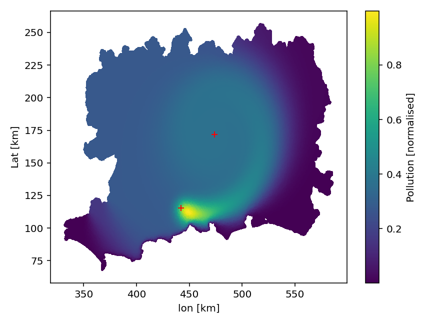

# Assignment 2 for MFC Numerics
Basic finite element solver that models the spread of pollution from Southampton to Reading with the linear advection-diffusion equation.

## Dependencies
* numpy (v2.1.1)
* matplotlib (v3.9.2)
* scipy (v1.14.1)

## What
Running main.py produces the plots in my report. 